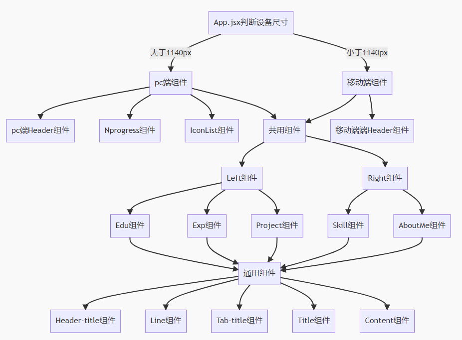

#### web 版个人简历项目

技术栈：vite、vue3、jsx、scss、axios 等。

涉及到详细技术点：vite 的摸索使用、jsx of vue3、vue3 新 API、Composition API、自适应与响应式布局、组件通信、通用组件封装、插件封装、svg 使用、状态监听、数据抽离、css 媒体查询、scss 应用、一键换肤功能、module.css、代码格式化等。

#### 项目结构

```
|— dist                              // 打包后文件
|— public                            // 存放json静态数据
|— src                               // 开发源代码
|   |— api                           // 抽离出的各接口地址url
|   |— assets                        // 存放静态资源
|   |— components                    // 开发通用组件
|   |   |— Content                   // 文本组件
|   |   |— Header-title              // 段落组件
|   |   |— Line                      // 竖线组件
|   |   |— Tab-title                 // 小标题组件
|   |   |— Title                     // 大标题组件
|   |— content                       // 页面主体内容
|   |   |— mobile                    // 移动端页面
|   |   |   |— components            // 移动端组件
|   |   |   |— index.jsx             // 移动端主页面
|   |   |— pc                        // pc端页面
|   |   |   |— components            // pc端组件
|   |   |   |— index.jsx             // pc端主页面
|   |   |— public                    // pc端和移动端共用组件
|   |— core                          // 项目核心封装库
|   |   |— auth                      // 缓存相关封装
|   |   |— request                   // axios封装
|   |— plugin                        // 插件
|   |   |— icons                     // svg封装
|   |— style                         // css相关
|   |   |— mobile                    // 移动端css
|   |   |— pc                        // pc端css
|   |   |— public                    // pc端和移动端共用组件css
|   |   |— common.scss               // 全局css
|   |   |— index.scss                // 入口scss
|   |   |— normalize.scss            // normalize.css
|   |   |— print.scss                // 另存为pdf css
|   |   |— scrollbar.scss            // 滚动条css
|   |   |— variable.scss             // css 变量以及换肤
|   |— App.jsx                       // 根组件
|   |— main.js                       // 项目入口js
|— vue.config.js                     // vuecli配置
|— .env                              // 存放通用变量
|— *略
```

#### 项目逻辑



#### 数据渲染模式

改版后简历中所有数据都为 json 文件存放 public 中用 axios 进行请求，数据与代码分离，便于维护。(后期考虑开发 Node.js 程序进行文件管理)

json 主要分为以下几块：

- 1.**exp.json**：存放公司 code 数组，code 为新建公司 json 文件名称，例如 [ "baidu", "alibaba" ]，新加公司时创建 baidu.json/alibaba.json,接口自动遍历 json 数据并请求所有公司 json 数据合并为数据展示在 Epx.jsx 组件中，代码详见**src/content/public/Exp**文件夹下。
- 2.info.json：存放个人信息 json
- 3.me.json：存放自我介绍信息
- 4.project.json：存放个人项目信息
- 5.存放个人掌握技能相关信息

#### &v1.2 2020-02-07 改版优化

- [x] jsx
- [x] 数据逻辑抽离
- [x] 响应式+自适应 rem
- [x] 夜间模式
- [x] 优化代码组件逻辑
- [x] 优化移动端滚动条

#### 未解决问题

- [ ] 加入新 svg 图标时无法实时热更新
- [ ] 初始加载动画效果卡顿
